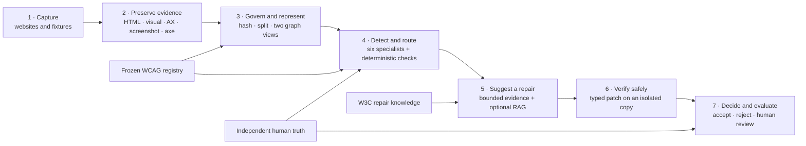
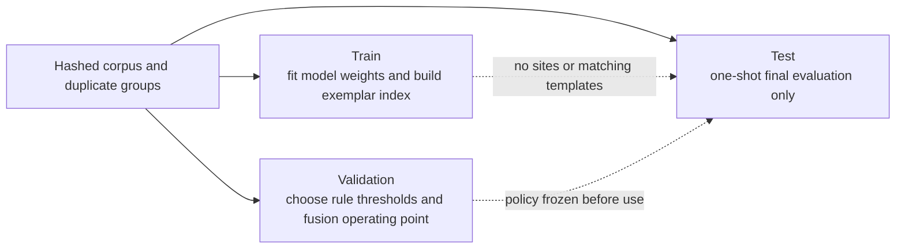
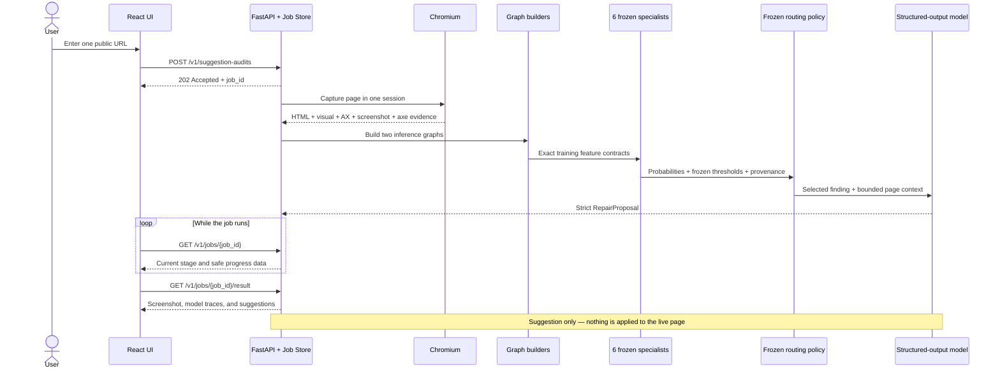
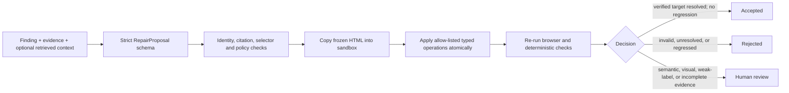

# Accessibility Detection and Repair System Architecture

This document describes the current `learning_v2` and `accessibility_system`
architecture. It is written for a reader who is new to the project.

## The system in one minute

The project has two connected parts:

1. **Detection** — capture a webpage, represent it as two graphs, run several
   trained specialists, and decide whether each WCAG criterion fails, passes,
   needs review, or is unsupported.
2. **Repair** — give a detected finding and bounded evidence to either a
   deterministic template or a language model, apply the proposed change only
   to an isolated copy, and validate it before accepting, rejecting, or sending
   it to a human.

The shortest mental model is:

> **Capture → Represent → Detect → Route → Suggest → Validate → Evaluate**

The live demonstration stops at **Suggest**: it never changes the submitted
website. The Phase 9 research runner can apply a proposal, but only to a copied
HTML file inside a validation sandbox.

## End-to-end architecture

The editable diagram below expresses the same flow:

The arrows show data flow, not a claim that every command runs in one process.
The training pipeline and the repair pipeline are separate packages and exchange
versioned JSON files and model artifacts.

## Why there are two graph views

A webpage has more than one useful structure. The project therefore observes
the same page in two ways:

| View | What it represents | Best suited to |
| --- | --- | --- |
| **Accessibility-tree graph** | What assistive technology receives: roles, names, states, and accessible parent/child relationships | Missing alternative text, labels, and accessible link names |
| **Rendered-visual graph** | DOM structure plus computed layout, colour, visibility, focusability, and text features | Visual issues such as colour contrast |

For each view, the system trains the same three model families:

- **MLP** — sees each node's features but does not pass messages between nodes;
- **GraphSAGE** — learns from a node and its neighbours;
- **GAT** — learns which neighbouring nodes deserve more attention.

This produces six comparable specialists. Within a view, they use the same
sites, features, rule set, training budget, and calibration method. That makes
the architecture comparison fair.

## What one captured site contains

The canonical corpus is under
[`2_Data/browser-use/outputs/dataset_v3.0/axe-core`](2_Data/browser-use/outputs/dataset_v3.0/axe-core).
Each site directory is an aligned evidence bundle:

| File | Plain-English meaning | Main consumers |
| --- | --- | --- |
| `0.html` | Frozen rendered HTML | inventory, graph builders, deterministic rules, repair sandbox |
| `0.visual.json` | Computed position, size, colour, contrast, visibility, and focus information | rendered-visual graph builder and repair evidence |
| `0.ax.json` | Chromium's live accessibility tree mapped back to page nodes | accessibility-tree graph builder |
| `0.png` | Screenshot from the same capture session | annotation, review, and visual comparison |
| `page-0_home.json` | Full axe-core result | weak training labels, baseline evidence, and validation |
| `summary.json` | Collection status and aggregate counts | corpus inventory and diagnostics |

The HTML, visual sidecar, accessibility tree, screenshot, and axe report are
captured from the same browser session. Their temporary node markers allow the
different views to be aligned.

The synthetic corpus under [`2_Data/synthethic`](2_Data/synthethic) provides
known problematic and repaired pages. It is used for controlled checks; it is
not a substitute for independently labelled real webpages.

## Offline research and training flow

The offline path builds the evidence needed to make defensible dissertation
claims.

| Phase | Responsibility | Important outputs |
| ---: | --- | --- |
| **0** | Freeze the WCAG study scope and issue families | `wcag_criteria.json`, `wcag_label_families.json` |
| **1** | Inventory complete sites, hash HTML, group duplicates, and freeze the split | corpus inventory, governed split, environment manifest |
| **2** | Build and audit aligned live-AX and rendered-visual graph caches | `.pt` graphs and cache-audit manifests |
| **3** | Create blinded annotation packets; combine two independent ratings through adjudication | independent validation and test truth |
| **4** | Run deterministic checks and controlled fixtures | deterministic and axe baseline reports |
| **5** | Train MLP, GraphSAGE, and GAT specialists for both views | checkpoints, calibration files, manifests, comparison report |
| **6** | Select the automatic-fail operating point on validation truth and freeze fusion policy | versioned fusion policy and threshold evidence |
| **7** | Perform a one-shot held-out detection study | detection metrics, confidence intervals, ablations |
| **8** | Build the leakage-controlled knowledge and retrieval layer | knowledge graph, retrieval corpus, generator inputs |
| **9** | Generate bounded repairs and validate them in isolation | proposals, before/after evidence, acceptance decisions |
| **10** | Compare deterministic, no-RAG, flat-RAG, and Graph-RAG repair conditions | matched study, replicate analysis, human-rating packet |

### Leakage boundary

The split is a core part of the architecture, not just a training option:

- Duplicate or near-identical pages must not cross partitions.
- Retrieval exemplars come only from training sites.
- Validation chooses thresholds; test data does not tune them.
- Final validation and test truth must be independently human-adjudicated.
- The saved split hash identifies the experiment. Changing it creates a new run.

## Detection decision flow

The system does not treat a model score as a final accessibility judgement.

1. Each specialist outputs a probability for the rules it supports.
2. A rule-specific threshold, learned only from validation data, converts that
   score into an observation.
3. The WCAG registry decides which detectors are relevant to the criterion.
4. Fusion keeps all contributing evidence and records disagreements or failed
   collectors.
5. The result is one of:

   - `fail` — enough verified evidence supports an automatic failure;
   - `pass` — all usable routed observations pass;
   - `needs_review` — evidence conflicts or is not strong enough to automate;
   - `unsupported` — the system has no suitable detector;
   - `collection_failed` — required evidence could not be captured.

There is deliberately no general “low score means automatic pass” threshold.
Abstention and human review are first-class outputs.

## Live suggestion flow

The live demo uses [`4_UI/learning-v2-demo`](4_UI/learning-v2-demo) and the
FastAPI service in
[`3_Learning/accessibility_system/api.py`](3_Learning/accessibility_system/api.py).

Important runtime boundaries:

- The URL must be public HTTP(S); private, loopback, link-local, reserved, and
  credential-bearing destinations are rejected.
- axe is recorded as independent scan evidence. It is **not** part of the
  learned model's inference feature fingerprint.
- The live `/v1/suggestion-audits` path currently creates finding-grounded
  `no_rag` prompts. Phase 8 RAG contexts are used by the research repair path,
  exposed through `/v1/rag/inputs` and `/v1/repairs`.
- API keys stay on the server and are not accepted in browser request bodies or
  returned in job results.
- Slow browser and model work runs asynchronously; the UI polls a job record.

## Repair and validation flow

Phase 9 treats generated content as untrusted input.

The model cannot return a raw patch or executable code. It can request only
typed operations such as setting or removing an allow-listed attribute,
replacing text, inserting a label, changing an allow-listed CSS property, or
removing a viewport zoom restriction.

Validation checks include:

- HTML parsing and unique selector resolution;
- originating-finding resolution;
- new axe or deterministic regressions;
- live accessibility-tree differences;
- keyboard focus replay;
- screenshot and visual differences;
- protected link, form, script, and functional behaviour;
- before/after hashes and proof that the source corpus was unchanged.

An automatic `accepted` result requires a verified target resolution and zero
new in-scope regressions. Semantic uncertainty, weak labels, CSS visual changes,
or incomplete browser evidence are sent to human review.

## Package and directory ownership

| Location | Owns |
| --- | --- |
| [`2_Data/browser-use`](2_Data/browser-use) | browser collection, axe scanning, and aligned evidence capture |
| [`2_Data/synthethic`](2_Data/synthethic) | controlled accessible/inaccessible web fixtures |
| [`3_Learning/learning_v2`](3_Learning/learning_v2) | governed splits, graph contracts, model training, calibration, fusion, live inference, and detection evaluation |
| [`3_Learning/accessibility_system/retrieval`](3_Learning/accessibility_system/retrieval) | W3C knowledge records, training exemplars, indexing, retrieval conditions, and grounding evaluation |
| [`3_Learning/accessibility_system/repair`](3_Learning/accessibility_system/repair) | strict repair contracts, model adapter, grounding policy, typed patching, and sandbox validators |
| [`3_Learning/accessibility_system/evaluation`](3_Learning/accessibility_system/evaluation) | matched repair studies, stochastic replicates, blinded ratings, and dissertation tables |
| [`3_Learning/accessibility_system/api.py`](3_Learning/accessibility_system/api.py) | public URL safety checks, asynchronous jobs, scan/RAG/repair endpoints, and result access |
| [`4_UI/learning-v2-demo`](4_UI/learning-v2-demo) | the live suggestion interface and transparent execution trace |

The separation between `learning_v2` and `accessibility_system` is intentional:
retrieval or language-model orchestration cannot silently enter the detector's
training features.

## Trust boundaries and invariants

These rules are the architectural safety rails:

1. **The source corpus is immutable.** Repairs operate on copied HTML.
2. **Labels are not model inputs.** axe labels are structurally separate from
   `x`, `edge_index`, and `tag_indices`.
3. **Calibration precedes testing.** Validation chooses thresholds; the frozen
   policy is then used once on test.
4. **Every important artifact is versioned and hashed.** Feature contracts,
   checkpoints, splits, truth files, policies, inputs, outputs, and manifests
   can be checked for mismatch.
5. **Unsupported is not pass.** Missing detectors or failed collection remain
   visible.
6. **Generated output is constrained.** Strict schemas, allow-lists, grounding
   checks, atomic edits, and browser validation stand between the model and an
   accepted repair.
7. **Human judgement remains explicit.** Semantic correctness and uncertain
   visual/contextual changes cannot be accepted from syntax alone.

## Current scientific status

The architecture is implemented end to end, but an executable pipeline is not
the same as a completed scientific claim.

- Historical real-page data is largely axe-derived weak truth.
- Final detection claims require complete independent validation and test
  annotations with two raters and adjudication.
- The controlled Phase 10 benchmark showed equal repair success for the
  deterministic and three LLM conditions; it does not establish Graph-RAG
  repair superiority.
- The stochastic repair study still requires balanced predeclared replicates.
- The blinded contextual-quality rating study must be completed before the
  final repair gate closes.

The fail-closed readiness audit keeps these incomplete items visible instead of
reporting the dissertation pipeline as finished.

## Recommended reading order

1. This architecture document.
2. [`i_give_up.md`](i_give_up.md) for the exact Phase 0–10 run order.
3. [`3_Learning/learning_v2/README.md`](3_Learning/learning_v2/README.md) for
   detector training and evaluation commands.
4. [`3_Learning/accessibility_system/README.md`](3_Learning/accessibility_system/README.md)
   for retrieval, repair, validation, and API commands.
5. The `PHASES_*_REPORT.md` files in
   [`3_Learning/learning_v2`](3_Learning/learning_v2) for executed results,
   gates, and limitations.

## Small glossary

- **AX tree** — the accessibility tree exposed by the browser to assistive
  technologies.
- **axe-core** — an established deterministic accessibility scanner used for
  baseline evidence and weak labels.
- **Calibration** — selecting a decision threshold using validation data rather
  than test data.
- **Finding** — one detected issue plus its criterion, rule, target, evidence,
  confidence, and provenance.
- **Fusion** — combining routed observations without discarding their sources
  or disagreements.
- **RAG** — retrieval-augmented generation; supplying selected knowledge to the
  repair model before it proposes a change.
- **Weak label** — a label produced by an automated tool rather than independent
  human adjudication.
