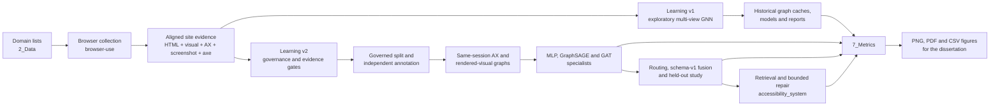
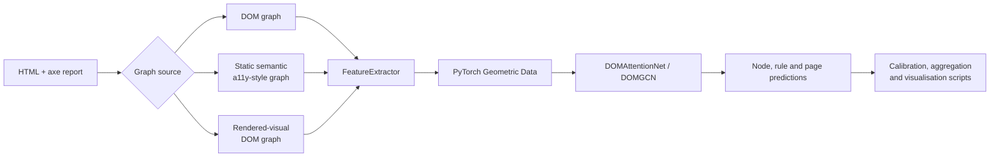
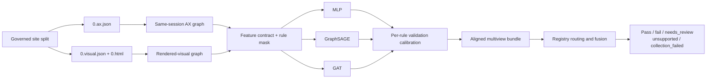

# Project Structure and Architecture

This document describes how the dissertation repository is organised and how
data moves through collection, the two learning implementations, evaluation,
and report-figure generation. It distinguishes executable source code from
generated evidence and historical experiment outputs.

## Architecture at a glance



The dataset is shared by both learning versions. Learning v1 is retained as
the original exploratory implementation. Learning v2 is the governed
experimental pipeline used for the frozen v3.0 evidence and downstream system.

## Repository map

```text
qmul-dissertation/
├── 1_Data/                       Domain inputs and browser evidence collection
├── 3_Learning/
│   ├── learning_v1/              Original DOM/multi-view GNN implementation
│   ├── learning_v2/              Governed specialist-learning pipeline
│   ├── accessibility_system/     Retrieval, generation and repair validation
│   ├── runs_v1/                  Historical v1 graph/model runs
│   ├── runs_v3.0/                Frozen v3.0 graph caches
│   ├── runs_reproduction/        Reproduction graph caches
│   ├── graphs_multi_20July_2200/ Historical graph artifacts
│   ├── models_20July_2200/       Historical model artifacts
│   └── reports/                  Historical and diagnostic reports
├── 4_UI/                         Interfaces for live audits and rater packets
├── 2_Metrics/                    Publication figure-generation layer
```

Generated directories can be large and may be ignored by Git. Their contents
are experimental evidence, not importable source packages.

## 1. Data layer: `1_Data`

### Main collector

`2_Data/browser-use` owns acquisition of the real-page evidence corpus.

```text
2_Data/browser-use/
├── main.py                 Collection orchestration and parallel site workers
├── axe.py                  axe-core injection, execution and report summaries
├── rendered_snapshot.py    Same-session DOM, visual, AX and screenshot capture
├── robots_policy.py        robots.txt admission policy
├── auth.py                 Optional login and signup support
├── domains.csv             Domain queue and collection status
├── axe-core.min.js         Repository-pinned accessibility scanner
├── tests/ or test_*.py     Collector and policy tests
└── outputs/
    └── dataset_v3.0/
        └── axe-core/
            └── <site>/     One evidence bundle per domain
```

### Per-site evidence contract

The governed v3.0 corpus is rooted at:

```text
2_Data/browser-use/outputs/dataset_v3.0/axe-core/<site>/
├── 0.html                  Rendered HTML snapshot
├── 0.visual.json           Computed styles, geometry and DOM marker mapping
├── 0.ax.json               Chromium full accessibility tree and marker mapping
├── 0.png                   Same-session page screenshot
├── page-0_home.json        axe-core result for the audited page
└── summary.json            Site-level collection summary
```

The first five files form the aligned model/evaluation bundle. The marker
mapping connects DOM nodes, rendered features and Chromium AX nodes captured in
the same browser session. `summary.json` records collection status but is not a
model input.

### Data flow

1. `domains.csv` or explicit `--site` arguments provide targets.
2. `robots_policy.py` decides whether automated collection is permitted.
3. `main.py` opens the page, optionally handles authentication, and waits for a
   stable rendered state.
4. `axe.py` runs the pinned axe-core scanner.
5. `rendered_snapshot.py` captures HTML, visual properties, the Chromium AX
   tree and screenshot before temporary node markers are removed.
6. The aligned bundle is written below the site directory and later admitted
   or rejected by Learning v2 governance checks.

## 2. Learning v1: original exploratory implementation

`3_Learning/learning_v1` is the first DOM-to-GNN system. It supports single-site
and multi-site training and three graph-source views.

```text
3_Learning/learning_v1/
├── src/
│   ├── html_graph_builder.py          HTML DOM to PyG graph
│   ├── accessibility_graph_builder.py Static semantic/AX-style graph
│   ├── graph_sources.py               DOM, a11y-tree and rendered-view routing
│   ├── feature_extractor.py           Text, attribute, visual and axe mapping
│   ├── models.py                      DOMAttentionNet and DOMGCN
│   ├── train.py                       Losses, training and evaluation loop
│   ├── wcag_rules.py                  Rule ownership by graph source
│   └── utils.py                       Shared validation helpers
├── scripts/
│   ├── process_page.py                Single-page graph pipeline
│   ├── train_single_page.py           Augmented single-page experiment
│   ├── train_multi_site.py            Multi-site and multi-view training
│   ├── calibrate_thresholds.py        Post-training threshold calibration
│   ├── predict_site.py                Model inference and rule filtering
│   ├── aggregate_gnn_batch.py         Aggregate prediction reports
│   ├── visualize_graph.py             Graph and prediction visualisation
│   └── smoke_remediation.py           Early deterministic repair experiment
└── train_all_sites.sh                 Historical batch launcher
```

### v1 processing architecture



Key characteristics of v1:

- Graph views are built through one script-oriented training system.
- The accessibility view is reconstructed from saved semantic HTML rather than
  consuming the crawler's same-session Chromium AX sidecar.
- axe findings are mapped to graph nodes and used as development labels.
- The implementation includes exploratory single-page augmentation and
  historical multi-view training.
- Outputs live mainly under `runs_v1`, the dated graph/model directories and
  `3_Learning/reports`; these are retained for provenance, not treated as the
  governed final pipeline.

## 3. Learning v2: governed experimental pipeline

`3_Learning/learning_v2` separates data governance, feature contracts, model
training, calibration, routing and evaluation. It also records hashes and
manifests so that outputs can be traced to a corpus and frozen split.

### Functional layers

```text
3_Learning/learning_v2/
├── catalog/
│   ├── build_registry.py         Build governed WCAG registries
│   ├── criteria.py               Criterion records and scope
│   └── families.py               Issue-family registry
├── governance.py                 Corpus inventory, deduplication and splitting
├── pipeline.py                   Phase 1–4 preparation orchestration
├── evidence.py                   Static evidence records and hashes
├── annotation_packet.py          Blinded human-rating packets
├── annotation_finalize.py        Agreement/adjudication to frozen truth
├── final_evaluation_split.py     Complete-case final split construction
├── regenerate_visual_cache.py    Rendered-visual graph cache
├── build_same_session_ax_cache.py Chromium AX-sidecar graph cache
├── cache_audit.py                Feature/provenance admission checks
├── assemble_multiview_bundle.py  Align view caches and trained models
├── data.py                       Graph discovery, loading and split validation
├── schema.py                     Feature contracts and inference fingerprint
├── feature_layout.py             Feature-column definitions
├── models.py                     MLP, GraphSAGE and GAT node-rule models
├── losses.py                     Sampled binary cross-entropy
├── trainer.py                    Optimisation, checkpointing and histories
├── calibration.py                Validation-derived per-rule thresholds
├── experiment.py                 Governed specialist comparison runner
├── rules.py                      Supported detector rules and mappings
├── contracts.py                  Observation and finding data contracts
├── fusion.py                     Registry routing and schema-v1 fusion policy
├── study.py                      Held-out site–criterion evaluation
├── visual_ablation.py            Controlled rendered-feature ablations
├── live_inference.py             Same-session capture and frozen-model scoring
├── readiness_audit.py            Cross-phase fail-closed audit
├── fixtures/                     Controlled HTML and truth fixtures
├── tests/                        Cross-phase and methodological guards
```

### Phase architecture

| Phase | Responsibility | Principal outputs |
|---|---|---|
| 0 | Build the WCAG criterion and issue-family registries | `wcag_criteria.json`, `wcag_label_families.json` |
| 1–4 | Inventory the corpus, deduplicate sites, freeze splits, collect baseline evidence and evaluate fixtures | inventory, governed split, environment, deterministic baseline |
| 2 | Convert aligned visual and Chromium AX sidecars into feature-versioned graphs and audit them | rendered and same-session AX caches, cache manifests and audits |
| 3 | Create blinded packets for two independent raters and adjudicate disagreements | annotation packet and independent truth |
| 5 | Train feature-matched MLP, GraphSAGE and GAT specialists and calibrate rule thresholds on validation data | checkpoints, calibrations, histories and comparison reports |
| 6–7 | Route observations, apply the frozen schema-v1 fusion policy and evaluate site–criterion decisions | fusion policy, fused findings, bootstrap metrics and run manifest |
| 8 | Build the training-only knowledge/retrieval layer | knowledge graph, retrieval corpus, queries and generator inputs |
| 9 | Generate typed repair proposals and validate them in isolation | repair attempts, before/after evidence and validation decisions |
| 10 | Compare repair conditions and human contextual-quality ratings | matched-study and rating reports |

### Model path



The model output unit is a node–rule score. `study.py` aggregates supported
rules to site–criterion decisions for evaluation. Missing evidence and failed
collection remain explicit states and are not converted into passes.

### Downstream retrieval and repair

Phases 8–10 live in `3_Learning/accessibility_system` so retrieval and repair
orchestration do not enter the learned-model package.

```text
3_Learning/accessibility_system/
├── retrieval/              Knowledge records, indexing, retrieval and prompts
├── repair/                 Typed proposal contracts, patching and validators
├── evaluation/             Repair studies, replicates and human-rating packets
├── phase8.py               Retrieval experiment entry point
├── phase9.py               Structured generation and validation entry point
├── controlled_benchmark.py Matched repair benchmark
├── deterministic_repair.py Non-LLM control
└── api.py                  Live scan/suggestion/repair HTTP API
```


## Metrics and publication figures: `7_Metrics`

`Metrics` is a read-only reporting layer over frozen experiment artifacts. It
does not train models or change predictions.


## 6. Artifact namespaces

| Path | Meaning |
|---|---|
| `2_Data/browser-use/outputs/dataset_v3.0/axe-core` | Source evidence corpus |
| `3_Learning/runs_v1` and dated graph/model directories | Historical Learning v1 runs |
| `3_Learning/runs_v3.0/graphs` | Frozen v3.0 graph caches |
| `3_Learning/runs_reproduction/graphs` | Reproduction graph caches |
| `3_Learning/learning_v2/artifacts_evidence-v3.0` | Frozen report-generating evidence |


## 7. End-to-end ownership boundaries

- `2_Data` owns acquisition and alignment of browser evidence.
- `learning_v1` owns the historical exploratory DOM/multi-view GNN workflow.
- `learning_v2` owns governance, graph contracts, specialist learning, routing
  and held-out detection evaluation.
- `accessibility_system` owns retrieval, structured repair and repair studies.
- `7_Metrics` owns deterministic transformation of frozen JSON/history records
  into publication figures.
- `4_UI` consumes the live API and annotation artifacts; it does not own model
  training or metric calculation.
- `report` consumes the final figures and tables for dissertation delivery.


# Links 

## Dataset

> Hosted in [2_Data](./2_Data/outputs). Due to big size, it is not included in the repository and it is hosted on Hugging Face.

- [Dataset](https://huggingface.co/AymanAlderson/dissertation_ayman/tree/main/dataset/dataset_v3.0/axe-core)

## Learning runs

 1. [Evidence artifacts:](https://huggingface.co/AymanAlderson/dissertation_ayman/tree/artifacts/artifacts_evidence-v3.0)
 2. [Graph runs:](https://huggingface.co/AymanAlderson/dissertation_ayman/tree/main/runs_v3.0/graphs)
